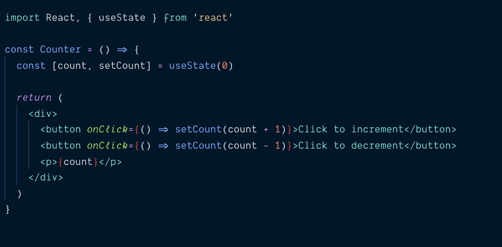
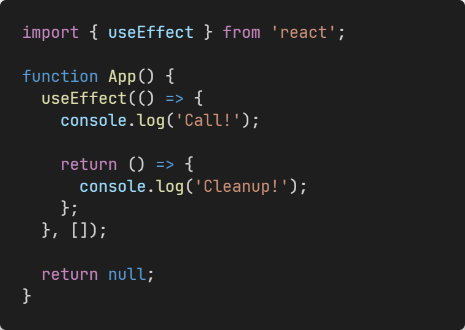

# Hooks 
## Хуки — нововведение в React 16.8, которое позволяет использовать состояние и другие возможности React без написания классов.
```JSX
import { useEffect, useState } from "react";

function App() {
  const [cnt, setCnt] = useState(0)
  const inc = ()=>{setCnt(cnt+1)};
  const dec = ()=>{setCnt(cnt-1)};
  return(
  <div>
      <button onClick={inc}>+</button>
        <h1>{cnt}</h1>
        <button onClick={dec}>-</button>
      
  </div>
  )
}

export default App;
```
 
# useState
## Первый хук, который мы изучим, это функция useState. Не беспокойтесь если этот пример будет поначалу неясен. Скоро мы разберёмся, как он работает.


# useEffect
## Принимает функцию, которая содержит императивный код возможно, с эффектами.
## Вместо этого используйте useEffect. Функция, переданная в useEffect, будет запущена после того, как рендер будет зафиксирован на экране. Думайте об эффектах как о лазейке из чисто функционального мира React в мир императивов.


# Rules to Remember
## Don’t call Hooks inside loops, conditions, or nested functions. Instead, always use Hooks at the top level of your React function, before any early returns
